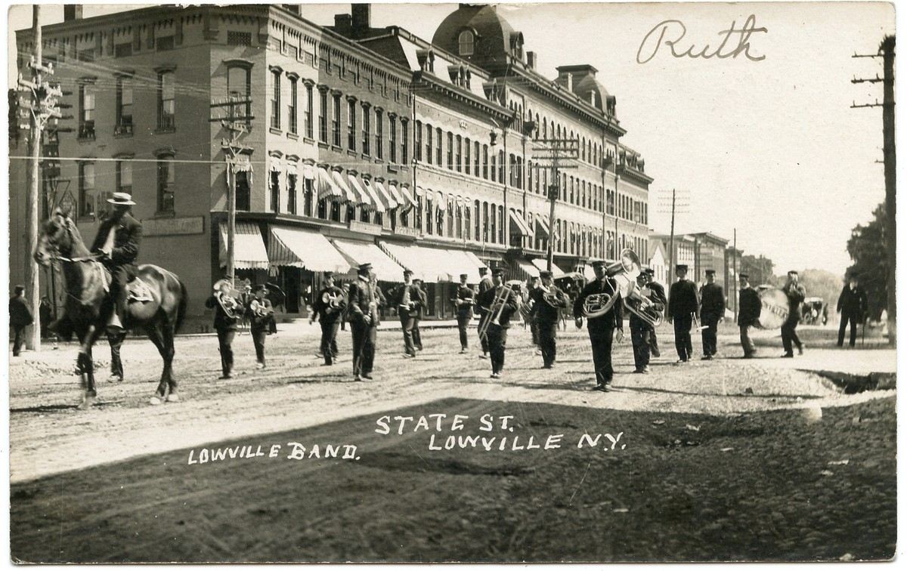
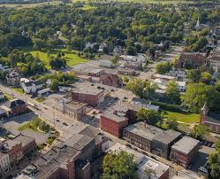

# About Lowville

- Lowville, New York is a historic town nestled in Lewis County, near the center of New York's North Country region.

- The town was established in 1800 and named after early landowner Nicholas Low.

- It is known for its rich agricultural heritage, particularly dairy farming, thanks to the fertile Black River Flats.

### Lowville Then: 

### Lowville Now: 

